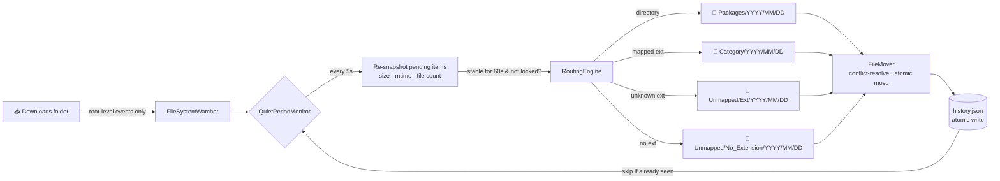

<div align="center">

# 🌀 Downganizer

### *Your Downloads folder, on autopilot.*

A bulletproof, 24/7 Windows Service that quietly organizes everything that lands in your Downloads folder — by type, by date, without ever touching what's still being written.

<br/>


</div>

---

## 😱 Before & After

```diff
─────────────────────────────────  BEFORE  ─────────────────────────────────
📁 C:\Users\You\Downloads
├── 📄 contract.pdf
├── 🖼️ vacation_001.jpg
├── 🖼️ vacation_002.jpg
├── 📄 invoice_april.pdf
├── 🎵 song.mp3
├── 📦 game-installer.zip
├── 🎬 lecture.mp4
├── 🗂️ massive-torrent-game/  ← still downloading 🚧
├── 📄 report.docx
├── 🤔 thing.unityproject     ← what even is this
└── ... 40 more items in chaos

─────────────────────────────────  AFTER  ──────────────────────────────────
📁 C:\Users\You\Downloads
├── 📁 Documents\2026\05\01\
│   ├── contract.pdf
│   ├── invoice_april.pdf
│   └── report.docx
├── 📁 Images\2026\05\01\
│   ├── vacation_001.jpg
│   └── vacation_002.jpg
├── 📁 Audio\2026\05\01\
│   └── song.mp3
├── 📁 Videos\2026\05\01\
│   └── lecture.mp4
├── 📁 Archives\2026\05\01\
│   └── game-installer.zip
├── 📁 Packages\2026\05\01\
│   └── massive-torrent-game\   ← moved as ONE atomic unit ✨
└── 📁 Unmapped\Unityproject\2026\05\01\
    └── thing.unityproject       ← unknown ext? auto-bucketed
```

---

## ⚡ Quickstart

```powershell
# 1. clone
git clone https://github.com/k3sra/Downganizer.git C:\Downganizer

# 2. install (builds + registers + starts the service, all in one)
cd C:\Downganizer\scripts
.\Downganizer.ps1 Install     # ← run as Administrator

# 3. live status + recent log tail
.\Downganizer.ps1 Status
```

That's it. The service is now running in the background, will auto-start on boot, and will auto-restart on crash.

---

## ✨ Features

| | |
|---|---|
| 🛡️ **Bulletproof** | 60-second deep-quiet protocol — never touches a file that's still being written |
| 📦 **Folders are sacred** | Torrent download? Unpacked installer? Moved as ONE atomic unit. No recursion. |
| 🧠 **Knows what's what** | 35 categories, 700+ extensions covering every common program out there |
| 🎯 **Date-bucketed** | `[Category]\YYYY\MM\DD\filename` — your Downloads becomes a time machine |
| 🚀 **Unknown extensions? Solved.** | `.unityproject` → `Unmapped\Unityproject\…` (auto-capitalized, auto-bucketed) |
| 💾 **JSON state, no SQL** | Atomic writes via temp-file + rename. Power-loss safe. |
| 🤚 **Manual override** | Move an organized file somewhere else? Service remembers and never re-touches it. |
| 🔄 **Auto-restart on crash** | SCM failure recovery: 5s → 10s → 30s, counter resets after 24h stable |
| 🌳 **Triple logging** | Console + Windows EventLog + rolling daily file logs |
| 🔧 **Conflict-proof** | Filename collision? `(1)`, `(2)`, `(3)` — never overwrites anything, ever |

---

## 🏛️ Architecture



---

## 🎯 Routing Rules

| Source | Destination |
|---|---|
| 📁 *Any directory* | `Packages\YYYY\MM\DD\<FolderName>\` |
| 🖼️ `photo.jpg` | `Images\YYYY\MM\DD\photo.jpg` |
| 📄 `report.pdf` | `Documents\YYYY\MM\DD\report.pdf` |
| 🎵 `song.flac` | `Audio\YYYY\MM\DD\song.flac` |
| 📦 `game.zip` | `Archives\YYYY\MM\DD\game.zip` |
| 🤔 `thing.wtf` | `Unmapped\Wtf\YYYY\MM\DD\thing.wtf` |
| ❓ `LICENSE` *(no ext)* | `Unmapped\No_Extension\YYYY\MM\DD\LICENSE` |
| ⚠️ collision with existing file | `<name> (1).ext`, `<name> (2).ext`, … |

---

## 📚 The 35 Categories

<table>
<tr>
<td>

**🎨 Visual**
- Images
- Videos
- Design
- Diagrams
- Models3D
- CAD
- Fonts

</td>
<td>

**📝 Documents**
- Documents
- Ebooks
- Spreadsheets
- Presentations
- Notebooks
- Subtitles

</td>
<td>

**💻 Code & Web**
- Code
- Web
- Scripts
- Data
- Configuration
- ProjectFiles

</td>
<td>

**🎵 Media**
- Audio

</td>
</tr>
<tr>
<td>

**📦 Packages**
- Archives
- Installers
- Containers

</td>
<td>

**💿 Disks & VMs**
- DiskImages
- VirtualMachines

</td>
<td>

**🛡️ Security & Data**
- Certificates
- Database
- Email
- Logs

</td>
<td>

**🎮 Other**
- GameData
- MachineLearning
- OfficeMacros
- Torrents
- SourceControl
- Crypto

</td>
</tr>
</table>

> 📝 *Add or remove categories freely in `config\config.json`. Anything not listed there is auto-bucketed under `Unmapped\<CapitalizedExtension>` — you never lose a file.*

---

## 🗂️ Project Layout

```
C:\Downganizer\
├── 📁 src\Downganizer\          ← .NET 8 Worker Service
│   ├── Program.cs                  Host bootstrap + DI
│   ├── Worker.cs                   FileSystemWatcher orchestration
│   ├── Configuration\              Config loading + validation
│   ├── Services\
│   │   ├── HistoryDatabase.cs      JSON state + atomic writes
│   │   ├── QuietPeriodMonitor.cs   The 60-second brain
│   │   ├── RoutingEngine.cs        Pure routing logic
│   │   └── FileMover.cs            Conflict-resolution + cross-volume
│   ├── Models\                     PendingItem · FileSnapshot · HistoryEntry
│   └── Logging\                    Custom rolling-daily file logger
├── 📁 config\
│   └── config.json                 ← edit this to customize
├── 📁 data\
│   └── history.json                ← runtime state (gitignored)
├── 📁 logs\
│   └── downganizer-YYYY-MM-DD.log  ← rolling logs (gitignored)
└── 📁 scripts\
    └── Downganizer.ps1             ← install/uninstall/start/stop
```

---

## ⚙️ Configuration

Open **`C:\Downganizer\config\config.json`** and edit:

```jsonc
{
  "WatchedFolder":       "C:\\Users\\You\\Downloads",
  "OutputRoot":          "C:\\Users\\You\\Downloads",
  "QuietPeriodSeconds":  60,    // ← deep-quiet wait before moving
  "ScanIntervalSeconds": 5,     // ← how often we recheck pending items

  "Categories": {
    "Images":    ["jpg", "png", "webp", "..." ],
    "Videos":    ["mp4", "mkv", "mov",  "..." ],
    "MyCustom":  ["myext", "myproj"],   // ← add your own!
    ...
  }
}
```

> 🔁 *Restart the service after editing:* `.\Downganizer.ps1 Restart`

---

## 🛠️ Service Commands

| Command | Effect |
|---|---|
| `.\Downganizer.ps1 Install`   | Build + register + start (one shot) |
| `.\Downganizer.ps1 Status`    | Show service state + tail recent log |
| `.\Downganizer.ps1 Restart`   | Stop and start |
| `.\Downganizer.ps1 Stop`      | Stop the service |
| `.\Downganizer.ps1 Start`     | Start the service |
| `.\Downganizer.ps1 Uninstall` | Stop + delete from SCM |
| `.\Downganizer.ps1 Reinstall` | Uninstall + Build + Install |
| `.\Downganizer.ps1 Build`     | Just publish, no service changes |

---

## 🛡️ Reliability

| Concern | How Downganizer handles it |
|---|---|
| 🔌 PC loses power mid-write | Atomic rename (`temp → final`) — JSON is never half-written |
| 🐛 Service crashes | SCM auto-restart: `5s → 10s → 30s`, reset after 24h |
| 🔥 OS reboots | Service is `start= auto`, comes back on next boot |
| ⚡ Watcher buffer overflows | Auto re-arm + re-do initial scan |
| 🥊 Two events for same file | `ConcurrentDictionary` + idempotent `Track()` |
| 📂 Directory still downloading | Recursive snapshot diff every 5s; 60s of stability required |
| 🔒 File locked by another app | `FileShare.None` probe; defers until unlocked |
| 🧨 Corrupt `history.json` | Quarantined as `.corrupt-<timestamp>`; service starts fresh |
| 👤 User manually moves a file | SHA-256 of name+size remembers it forever; never re-organized |

---

<div align="center">

### Made for downloads. Built to last. 🌀

*Drop. Forget. It just works.*

</div>
